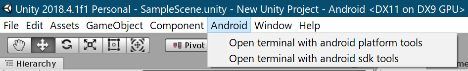

# unity-android-sdk-helper

## Installation

Add from GitHub | <em>not recommended, no updates through PackMan</em>

You can also add it directly from GitHub on Unity 2019.4+. Note that you won't be able to receive updates through Package Manager this way, you'll have to update manually.

- open Package Manager
- click <kbd>+</kbd>
- select <kbd>Add from Git URL</kbd>
- paste `https://github.com/shiena/unity-android-sdk-helper.git#1.0.2`
- click <kbd>Add</kbd>

<https://docs.unity3d.com/Packages/com.unity.package-manager-ui@2.1/manual/index.html>

## Usage

Switch platform to Android.

### Open terminal with android platform tools

Start terminal (Windows: cmd, macOS: Terminal.app) with Android Platform-Tools added to your PATH.
This is useful when you want to use `adb`.

### Open terminal with android sdk tools

Start terminal (Windows: cmd, macOS: Terminal.app) with Android SDK Tools added to your PATH.
This is useful when you want to use `sdkmanager`.
Also, when using the embedded Android SDK on Windows, open cmd with administrator privileges.

## Environment

* OS: Windows or macOS
* Unity with Package Manager: 2018.1 or higher
* Unity without Package Manager: 2017.1 or higher

## LICENSE

[MIT License](LICENSE)
